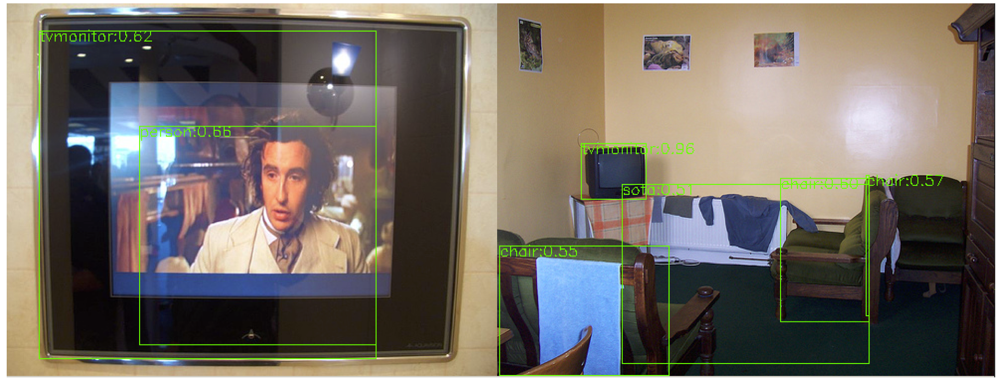

## RetinaNet

**Work in progress**

Standard RetinaNet implemented with Pure PyTorch

### Usage

* Compile NMS

````
cd lib/nms
make
````

* Modify `config.py` in `cfgs`

* Train

````
python train.py -d 2 -b 4 -e voc_baseline -ds VOC
````

* Test

````
python test.py -m log/voc_baseline/model_dump/epochxxx.pth -ds VOC -e voc_baseline
````

will output the detection results in `results.det` file.

### Output File '*.det'

each line is a json string.

````
{"im_id":'xxxx', "results":[{"class":xxx, "bbox":[xx,xx,xx,xx], "class":xxxx}]}
````

### Benchmarks
**Notice**: This part is under construction. Evaluation results and models on **COCO**,**PASCAL VOC** will be released soon. 


### Visualization Results

* PASCAL VOC




### Licence

This project is under the **MIT Licence**